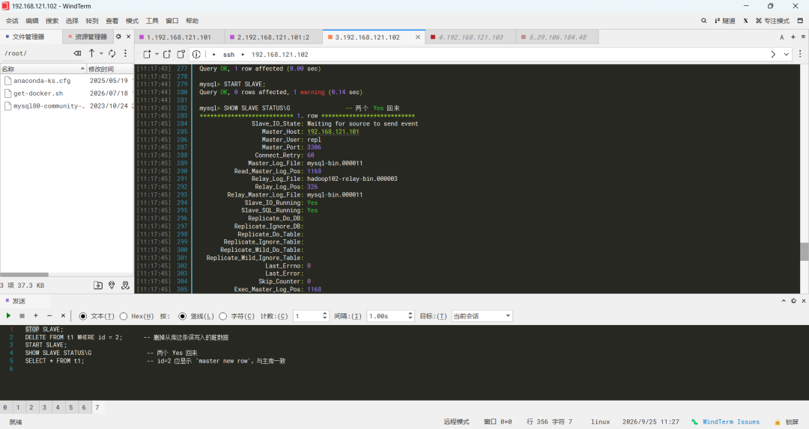
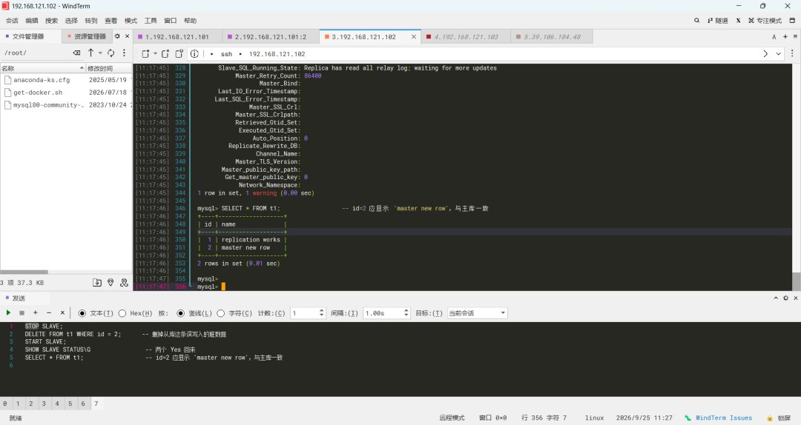

# 运维实战档案（DevOps 交付平台 + WAF 安全防护 + MySQL 排障实录）

应届运维工程师的真实项目留档：云原生 GitOps 交付链路（K8s + Harbor + Jenkins + ArgoCD）、企业级 WAF 安全防护（雷池 + Nginx 高可用），以及 MySQL 主从复制真实故障排障。
全部内容来自搭建与排障过程留档：运行截图、踩坑排障实录、架构说明。做到哪说到哪，不夸大不虚构。

## 项目一：云原生 DevOps 一体化交付平台

K8s + Calico + Harbor + Gitea + Jenkins + ArgoCD + Helm 完整 GitOps 链路。

- 第一阶段（2026-08，阿里云 ECS 按量付费，已释放）：单节点 K8s 集群 + Harbor/Gitea/Jenkins/ArgoCD 全家桶，GitOps CD 闭环，CI 构建为手动验证
- 第二阶段（2026-09，本地 VM）：Gitea + Jenkins 重建 CI 环节，Jenkinsfile + Poll SCM 实现提交代码后自动构建、自动部署，CI 闭环

以下为搭建时的真实截图与完整文档。

### 运行证据截图

| 截图 | 说明 |
|------|------|
|  | 集群节点全部 Ready |
|  | 全部 Pod 运行正常 |
|  | Gitea + Jenkins 部署 |
|  | ArgoCD 命名空间 |
|  | Harbor 命名空间 |
|  | ArgoCD Healthy/Synced |
|  | Harbor 镜像仓库 |
|  | demo 应用发布效果 |

### 文档

- [01-搭建实录](docs/devops/01-搭建实录.md)：从零到一的完整过程记录，含 18 条踩坑和知识点整理
- [02-架构与流水线说明](docs/devops/02-架构与流水线说明.md)：组件选型理由、一次发布的完整数据流、CI 两次实现对比
- [03-踩坑与排障记录](docs/devops/03-踩坑与排障记录.md)：两次搭建（云端集群 + 本地 VM）的 19 个实质性问题与排障方法论
- [04-Jenkins 本地 CI 流水线搭建实录](docs/devops/04-Jenkins本地CI流水线搭建实录.md)：服务器释放后在本地 VM 重建 CI 闭环，提交代码 → 自动构建 → 自动部署

## 项目二：企业级 Web 应用架构与安全防护（雷池 WAF）

阿里云 ECS + 雷池 WAF + Nginx + Docker，含高可用验证与排障记录。

- [实操记录与原理笔记](docs/waf/01-实操记录与原理笔记.md)

## 项目三：MySQL 主从复制排障实录（IO / SQL 两类线程故障）

两台虚拟机真实主从环境（MySQL 8.1.0 主 / 8.0.46 从），覆盖复制中断的两类典型故障：

- **IO 线程中断（error 1236）**：断连两年后主库 binlog 超过 30 天保留期被自动清理，从库起点文件已不存在；确认主从无数据差异后重新对接 binlog 坐标恢复
- **SQL 线程中断（error 1062）**：从库被误写入脏数据，主库同主键 binlog 事件重放冲突；删除脏行后从断点重放恢复，主从严格一致

- [01-error 1236 排障实录](docs/db/01-MySQL主从复制-error1236排障实录.md)：报错解读、根因取证、修复决策（直接对接 vs 备份重建的分界线）与监控要点
- [02-从库误写入排障实录](docs/db/02-MySQL主从复制-从库误写入排障实录.md)：1062 主键冲突的定位、三条修复路径取舍（删脏行重放 / skip counter / pt 工具）与 read_only 预防手段

| 截图 | 说明 |
|------|------|
|  | 从库 IO 线程中断，error 1236 报错 |
|  | 主库 binlog 列表与 30 天过期时间 |
|  | 修复后从库查询到主库新写入的数据 |
|  | 从库误写入修复：删脏行后双线程恢复 Yes |
|  | id=2 显示主库写入内容，主从数据一致 |
