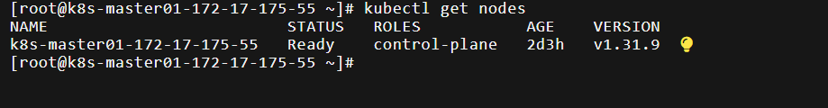
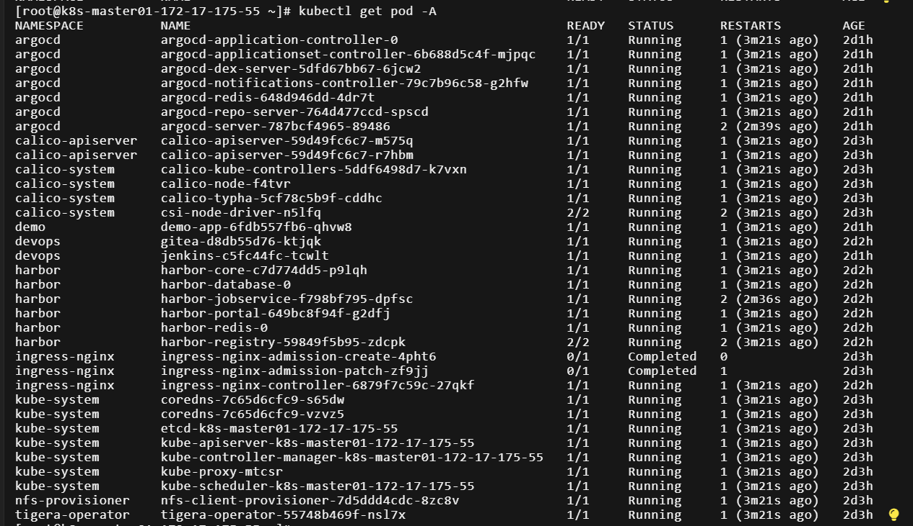
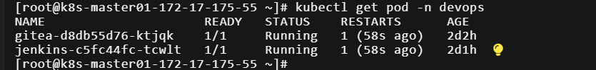
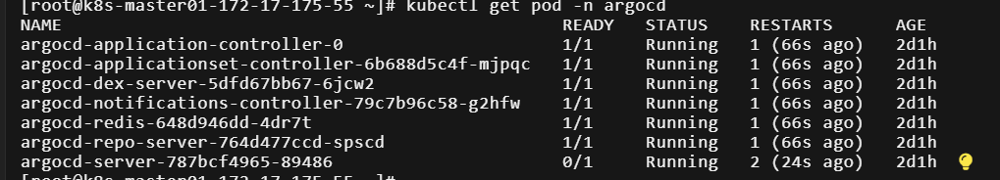
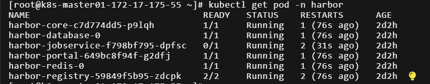
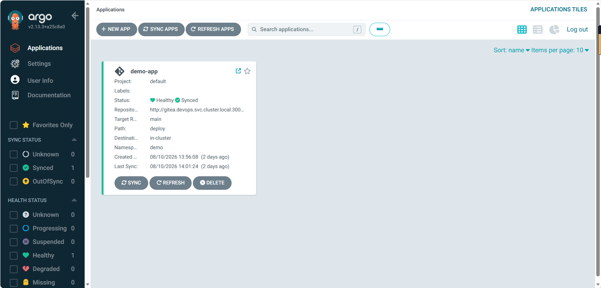
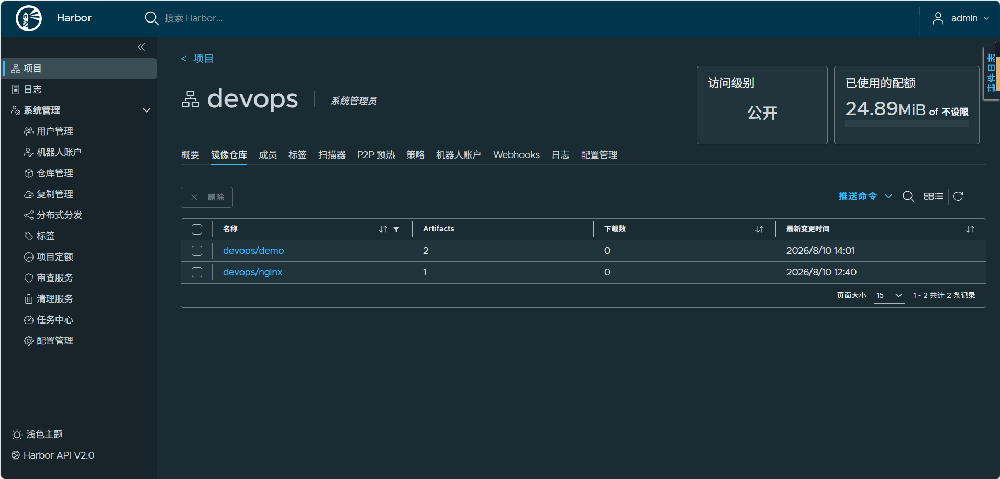
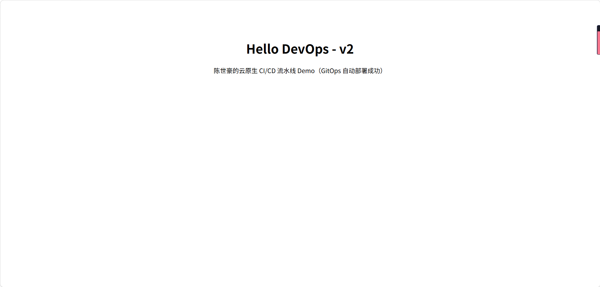

# 运维实战档案（DevOps 交付平台 + WAF 安全防护）

应届运维工程师的项目实战记录，全部内容来自真实搭建过程留档。

## 项目一：云原生 DevOps 一体化交付平台

K8s + Calico + Harbor + Gitea + Jenkins + ArgoCD + Helm 完整 GitOps 链路。

- 第一阶段（2026-08，阿里云 ECS 按量付费，已释放）：单节点 K8s 集群 + Harbor/Gitea/Jenkins/ArgoCD 全家桶，GitOps CD 闭环，CI 构建为手动验证
- 第二阶段（2026-09，本地 VM）：Gitea + Jenkins 重建 CI 环节，Jenkinsfile + Poll SCM 实现提交代码后自动构建、自动部署，CI 闭环

以下为搭建时的真实截图与完整文档。

### 运行证据截图

| 截图 | 说明 |
|------|------|
|  | 集群节点全部 Ready |
|  | 全部 Pod 运行正常 |
|  | Gitea + Jenkins 部署 |
|  | ArgoCD 命名空间 |
|  | Harbor 命名空间 |
|  | ArgoCD Healthy/Synced |
|  | Harbor 镜像仓库 |
|  | demo 应用发布效果 |

### 文档

- [01-搭建实录](docs/devops/01-搭建实录.md)：从零到一的完整过程记录，含 18 条踩坑和知识点整理
- [02-架构与流水线说明](docs/devops/02-架构与流水线说明.md)：组件选型理由、一次发布的完整数据流、CI 两次实现对比
- [03-踩坑与排障记录](docs/devops/03-踩坑与排障记录.md)：两次搭建（云端集群 + 本地 VM）的 19 个实质性问题与排障方法论
- [04-Jenkins 本地 CI 流水线搭建实录](docs/devops/04-Jenkins本地CI流水线搭建实录.md)：服务器释放后在本地 VM 重建 CI 闭环，提交代码 → 自动构建 → 自动部署

## 项目二：企业级 Web 应用架构与安全防护（雷池 WAF）

阿里云 ECS + 雷池 WAF + Nginx + Docker，含高可用验证与排障记录。

- [实操记录与原理笔记](docs/waf/01-实操记录与原理笔记.md)
