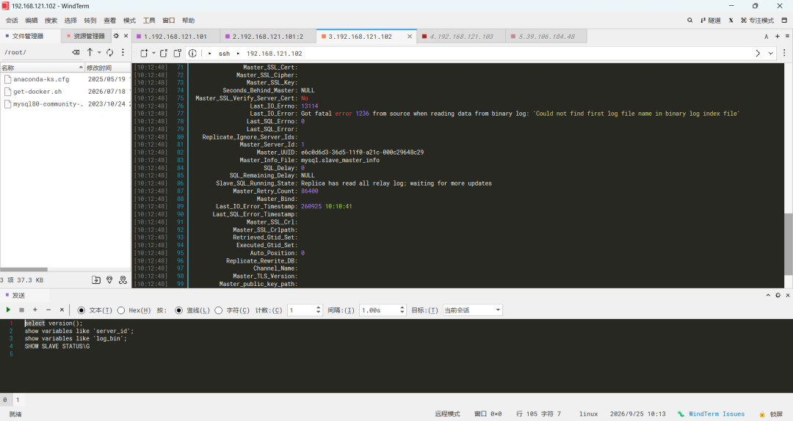
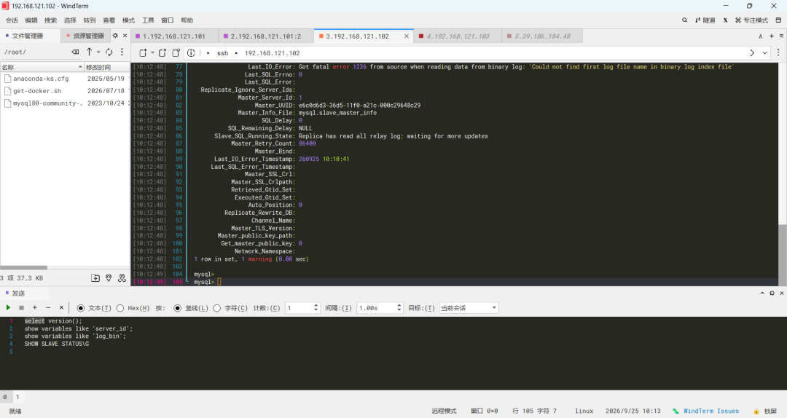
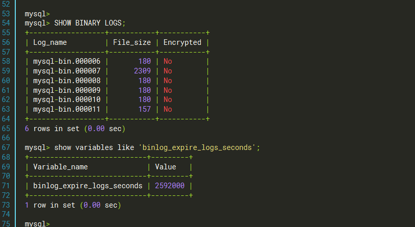
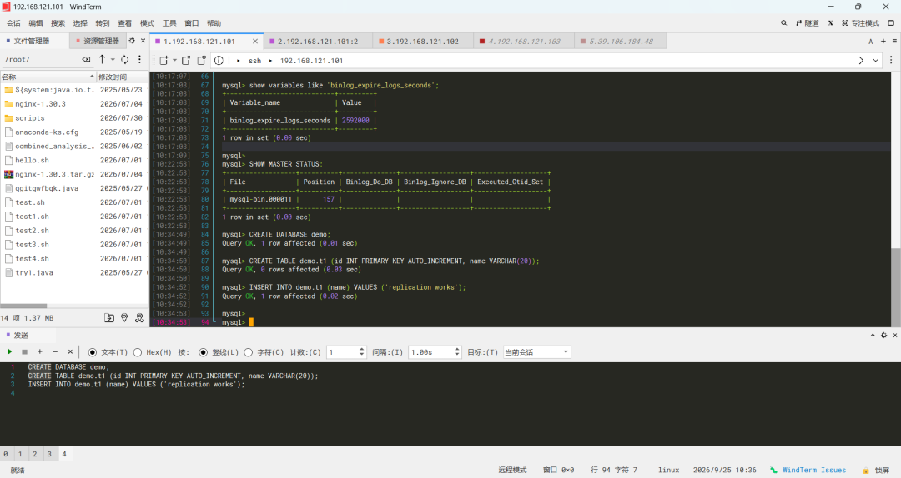
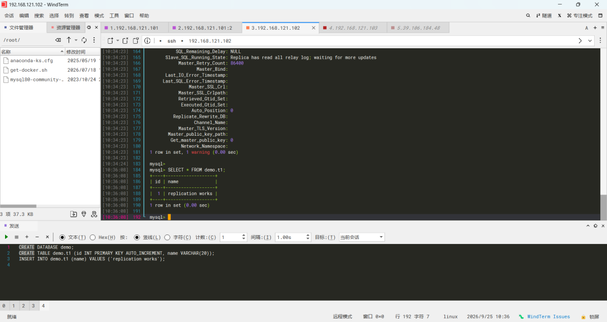

# MySQL 主从复制 error 1236 排障实录：断连两年后的复制恢复

> **环境**：两台本地虚拟机（192.168.121.0/24 网段）
> 主库 hadoop101 / 192.168.121.101 / MySQL 8.1.0（server_id=1）
> 从库 hadoop102 / 192.168.121.102 / MySQL 8.0.46（server_id=2）
> **排障时间**：2026-09-25

## 一、故障背景

这套主从复制于 2023 年 10 月搭建（基于 binlog 文件位置的异步复制，未启用 GTID）。2026 年 9 月对数据库环境做体检时，发现复制已中断。

本文是**故障恢复实录**，不是从零搭建记录——主从环境为两年前所搭，本次目标是定位中断原因、恢复复制并验证。

## 二、故障现象

从库执行 `SHOW SLAVE STATUS\G`，关键字段：

| 字段 | 值 | 解读 |
| --- | --- | --- |
| `Slave_IO_Running` | **No** | IO 线程挂了，无法从主库拉取 binlog |
| `Slave_SQL_Running` | Yes | SQL 线程正常，relay log 已全部重放完 |
| `Last_IO_Error` | `Got fatal error 1236 from source when reading data from binary log: 'Could not find first log file name in binary log index file'` | 从库向主库请求的 binlog 文件在主库已不存在 |
| `Seconds_Behind_Master` | NULL | 复制中断后延迟无法计算 |
| `Read_Master_Log_Pos` = `Exec_Master_Log_Pos` | 9941 = 9941 | 已拉取的日志全部重放完毕，从库无积压 |

截图： 

## 三、排查过程与根因定位

**第 1 步：解读报错。** error 1236 "Could not find first log file name in binary log index file" —— 从库 IO 线程向主库请求 `mysql-bin.000005`，但主库的二进制日志索引里已经没有这个文件。

**第 2 步：主库取证。**

```sql
SHOW BINARY LOGS;
-- 现存 binlog：mysql-bin.000006 ~ mysql-bin.000011（000005 及更早的已不存在）

show variables like 'binlog_expire_logs_seconds';
-- 2592000 秒 = 30 天（MySQL 默认值）
```

截图：

**第 3 步：根因确认。** binlog 超过 `binlog_expire_logs_seconds`（默认 30 天）会被自动 purge。从库断连时间接近两年，所需的起点文件 `mysql-bin.000005` 早已被清理，IO 线程无法续传。

**第 4 步：修复方式决策（关键判断）。** 观察现存 binlog 文件大小：000006~000011 均为 180 字节上下（空 binlog 轮转的典型尺寸），说明断连期间主库**没有真实业务写入**（这些文件是 MySQL 重启时自动轮转的产物）。结合从库 relay log 已全部重放完毕，可判断主从数据实际一致。

> 决策树：**主从无数据差异 → 直接重新对接 binlog 坐标；主库存在未同步写入 → 必须用备份（mysqldump / xtrabackup）重建从库**，直接改坐标会丢数据。

## 四、修复步骤

主库取当前 binlog 坐标：

```sql
SHOW MASTER STATUS;
-- File: mysql-bin.000011, Position: 157（Executed_Gtid_Set 为空，确认未启用 GTID）
```

从库重新对接并启动：

```sql
STOP SLAVE;
CHANGE MASTER TO
  MASTER_LOG_FILE='mysql-bin.000011',
  MASTER_LOG_POS=157;
START SLAVE;
SHOW SLAVE STATUS\G
-- Slave_IO_Running: Yes / Slave_SQL_Running: Yes / Seconds_Behind_Master: 0
```

`CHANGE MASTER TO` 只需给出要变更的参数，主库地址、复制账号等原配置保留不变。

## 五、端到端验证

主库写入：

```sql
CREATE DATABASE demo;
CREATE TABLE demo.t1 (id INT PRIMARY KEY AUTO_INCREMENT, name VARCHAR(20));
INSERT INTO demo.t1 (name) VALUES ('replication works');
```

从库查询：

```sql
SELECT * FROM demo.t1;
-- 返回 1 | replication works，主→从同步链路恢复
```

截图： 

## 六、复盘：知识点整理

1. **error 1236 的两类常见原因**：主库 binlog 已被 purge（本例）；`CHANGE MASTER TO` 指定的 binlog 文件名/位置填错。
2. **binlog 不是永久保存的**：由 `binlog_expire_logs_seconds` 控制（8.0 默认 2592000 秒 = 30 天），从库断连超过该期限且有日志轮转，就再也追不上。
3. **修复决策先看数据差异**：能直接重新对接的前提是"主从无未同步的差异数据"，否则必须备份重建——这是恢复操作不丢数据的分界线。
4. **复制的日常监控点**：`Slave_IO_Running` / `Slave_SQL_Running` 两个线程状态 + `Seconds_Behind_Master`（显示 NULL 即复制中断）。
5. **版本拓扑反例**：本环境为主库 8.1.0 → 从库 8.0.46，主比从新，不符合规范（从库版本应 ≥ 主库版本，避免主库新特性写入 binlog 后从库无法解析）。学习环境可运行，生产环境应修正。
6. **新旧命令对照**：8.0.22+ 推荐 `SHOW REPLICA STATUS` / `CHANGE REPLICATION SOURCE TO` / `SHOW BINARY LOG STATUS`，旧命令（`SHOW SLAVE STATUS` 等）仍可用但有 deprecated 警告。

## 七、一句话讲清楚

> "主从断连两年后从库 IO 线程报 error 1236，排查定位为主库 binlog 超过 30 天保留期被自动清理、从库所需起点文件已不存在；确认断连期间主从无业务写入（主从数据一致）后，通过 `CHANGE MASTER TO` 重新对接主库当前 binlog 坐标恢复复制，并做主写从读端到端验证。若主库存在未同步写入，则必须用备份重建从库。"

## 八、截图索引

| 文件 | 内容 |
| --- | --- |
| [01-master-env.png](../../screenshots/db/01-master-env.png) | 主库环境体检（8.1.0 / server_id=1 / log_bin=ON） |
| [02-slave-error-a.png](../../screenshots/db/02-slave-error-a.png) | 故障现场：从库复制状态（IO 线程 No） |
| [03-slave-error-b.png](../../screenshots/db/03-slave-error-b.png) | 故障现场：error 1236 报错原文 |
| [04-binary-logs-expire.png](../../screenshots/db/04-binary-logs-expire.png) | 主库取证：binlog 列表与过期时间 |
| [05-master-status-insert.png](../../screenshots/db/05-master-status-insert.png) | 修复坐标 + 主库写入验证数据 |
| [06-slave-select-success.png](../../screenshots/db/06-slave-select-success.png) | 从库查询到同步数据，恢复成功 |
