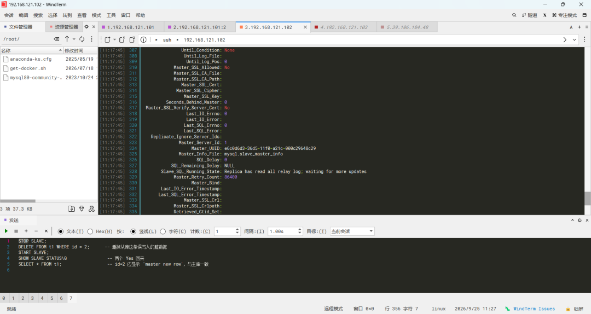

# MySQL 主从复制排障实录（二）：从库误写入脏数据导致 SQL 线程中断（error 1062）

> **环境**：同上一篇——主库 hadoop101 / 192.168.121.101 / MySQL 8.1.0（server_id=1）
> 从库 hadoop102 / 192.168.121.102 / MySQL 8.0.46（server_id=2）
> **排障时间**：2026-09-25

## 一、故障背景

上一篇恢复复制后，在 `demo.t1` 上人为模拟生产中最常见的复制中断场景之一：**从库被直接写入**。规范架构中从库应只读，但误操作或应用读写未分离、连接串指错，都可能在从库写入数据；随后主库 binlog 事件重放时与脏数据冲突，SQL 线程中断。

## 二、故障注入与现象

模拟过程：

1. 从库直接写入脏数据：`INSERT INTO demo.t1 (id, name) VALUES (2, 'dirty row');`
2. 主库正常业务写入：`INSERT INTO demo.t1 (id, name) VALUES (2, 'master new row');`
3. 主库的 INSERT 事件经 binlog 传到从库重放，主键 2 已存在 → 从库 SQL 线程报 **error 1062（Duplicate entry '2' for key 'PRIMARY'）**，`Slave_SQL_Running` 变为 **No**，复制中断。IO 线程不受影响，会继续拉取日志，relay log 开始积压。

（故障瞬间未单独留图，证据链见第四、五节的修复过程截图：`DELETE` 影响 1 行证实脏数据确实存在，重放后 id=2 变为主库内容证实主库事件重放成功。）

**两类线程故障的区别**：

| 中断线程 | 含义 | 典型案例 |
| --- | --- | --- |
| IO 线程（`Slave_IO_Running: No`） | 日志拉不进来 | 上一篇 error 1236：主库 binlog 已 purge |
| SQL 线程（`Slave_SQL_Running: No`） | 日志拉到了但重放失败 | 本篇 error 1062：从库脏数据主键冲突 |

## 三、排查与根因定位

**第 1 步：读报错字段。** `SHOW SLAVE STATUS\G` 中 `Last_SQL_Error` 会直接给出冲突的表和主键值；对照 `Read_Master_Log_Pos`（IO 拉到哪里）与 `Exec_Master_Log_Pos`（SQL 重放到哪里）可定位出错的具体 event。

**第 2 步：判断冲突性质。** 区分两种情况：脏数据是**从库独有**的（本例：从库被误写，主库的 id=2 才是正确数据），还是主从都有该行但**内容不一致**。前者删掉脏行即可，后者要逐行比对。

**第 3 步：修复方式决策（三条路径）。**

- **删脏数据后重放（本例采用）**：脏行确认是误写入、无业务含义，删掉让主库事件正常重放，主从严格一致；
- **`sql_slave_skip_counter=1` 跳过单个 event**：操作快，但主库这条 INSERT 被丢弃（从库将永远没有 id=2），主从从此不一致，只适合明确知道该 event 可跳过的场景；
- **pt-table-checksum + pt-table-sync**：冲突范围大、不确定哪些行不一致时，先校验找差异再批量修复，或干脆备份重建从库。

## 四、修复步骤

```sql
STOP SLAVE;                        -- Query OK, 1 warning（8.0 对 SLAVE 旧语法的 deprecated 警告）
DELETE FROM demo.t1 WHERE id = 2;  -- Query OK, 1 row affected —— 证实脏行确实存在
START SLAVE;
SHOW SLAVE STATUS\G
-- Slave_IO_Running: Yes / Slave_SQL_Running: Yes
-- Read_Master_Log_Pos = Exec_Master_Log_Pos = 1168（拉取与重放位点一致，无积压）
-- Seconds_Behind_Master: 0
-- Slave_SQL_Running_State: Replica has read all relay log; waiting for more updates
```

原理：`STOP SLAVE` 停掉 SQL 线程；删除冲突行后 `START SLAVE`，SQL 线程从断点（`Exec_Master_Log_Pos`）继续重放，主库那条 `INSERT id=2` 成功执行。

截图： 

## 五、验证

```sql
SELECT * FROM demo.t1;
-- 1 | replication works
-- 2 | master new row      ← 是主库写入的内容，而非脏数据 'dirty row'
-- 2 rows in set
```

id=2 显示的是主库写入的 `master new row`，证明重放的是主库事件、主从数据一致。

截图：

## 六、复盘：知识点整理

1. **SQL 线程中断的头号原因是"从库被写入"**：生产从库必须设 `read_only=ON`，8.0 推荐再加 `super_read_only=ON`（连 SUPER 权限用户也无法写），从机制上杜绝此类故障。
2. **排障第一动作是看 `Last_IO_Error` / `Last_SQL_Error`**：两个线程、两类错误，排查方向完全不同。
3. **skip counter 是把双刃剑**：跳过 event 等于主动制造主从不一致，除非确定该 event 无业务影响，否则不用。
4. **恢复后必查两个值**：`Read_Master_Log_Pos` = `Exec_Master_Log_Pos`（无积压）+ `Seconds_Behind_Master` = 0（无延迟），再抽查数据内容。
5. **大范围不一致别手工修**：用 pt-table-checksum 找差异、pt-table-sync 修复，或直接备份重建从库。

## 七、一句话讲清楚

> "模拟从库误写入脏数据（id=2）后，主库同主键写入的 binlog 事件在从库重放失败，SQL 线程报 error 1062 主键冲突、复制中断；确认脏数据为从库独有误写入后，`STOP SLAVE` 删除冲突行、`START SLAVE` 让主库事件从断点重放成功，验证双位点一致、`Seconds_Behind_Master=0`、从库数据与主库一致。生产预防手段是从库开启 `read_only` / `super_read_only`。"

## 八、截图索引

| 文件 | 内容 |
| --- | --- |
| [07-slave-dirty-fix.png](../../screenshots/db/07-slave-dirty-fix.png) | 修复过程：STOP SLAVE → DELETE 脏行（1 row affected）→ START SLAVE，双线程恢复 Yes、位点一致 |
| [08-slave-status-seconds-behind.png](../../screenshots/db/08-slave-status-seconds-behind.png) | 恢复后状态：Seconds_Behind_Master=0，relay log 全部重放完毕 |
| [09-slave-select-consistent.png](../../screenshots/db/09-slave-select-consistent.png) | 数据验证：id=2 为主库写入的 'master new row'，主从一致 |
